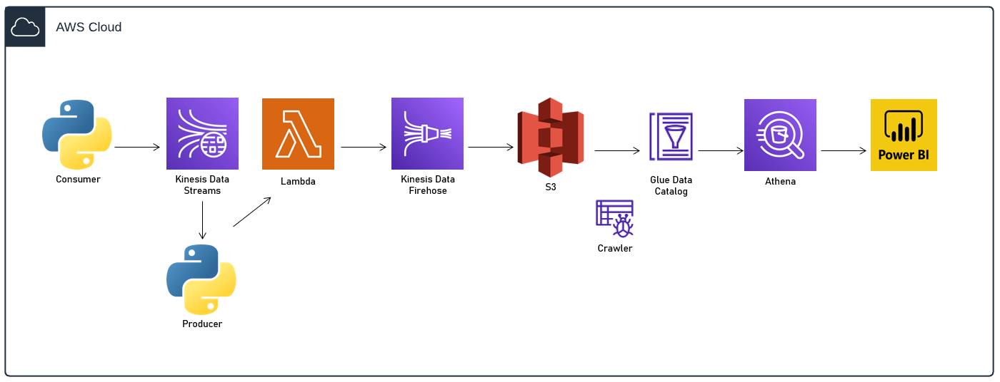
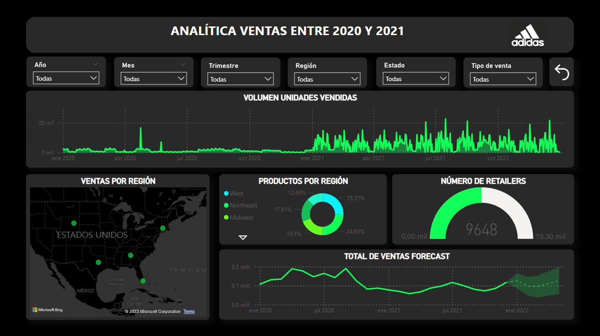

# adidas-sales-stream





A simple stream architecture is proposed, it is partially created through a stack given by CloudFormation in its YAML format.

``` bash
aws cloudformation create-stack --stack-name StackKDS --template-body file://kds.yaml
```

The objective is to use the Kinesis Data Stream service to propose the interaction between a data producer (stream generator) and a data consumer, as an alternative to Apache Kafka in its cloud mode. The capicity mode is provisioned using only 1 shard.

In this case, the dataset used is taken from Kaggle to generate a data stream in real time.

The lang of the dashboard is spanish.


